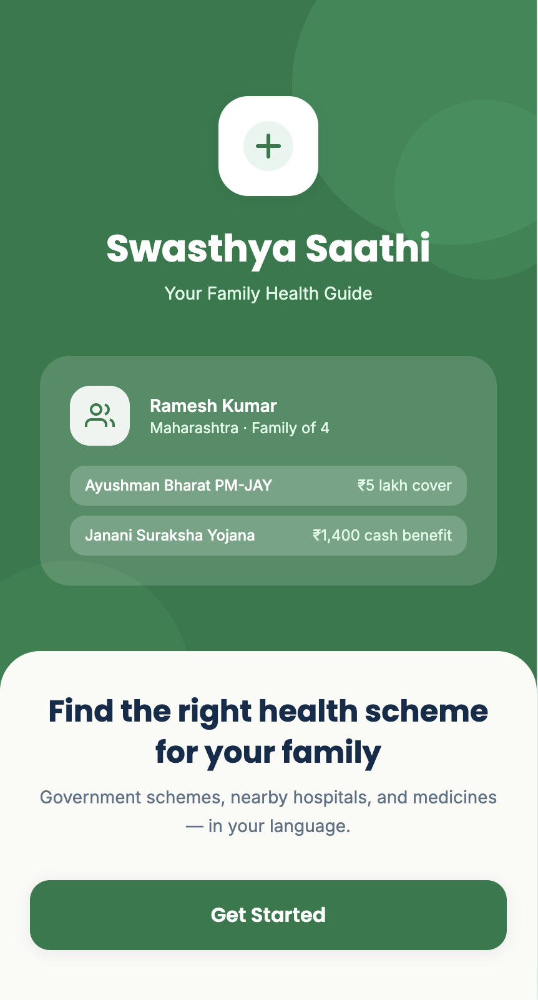
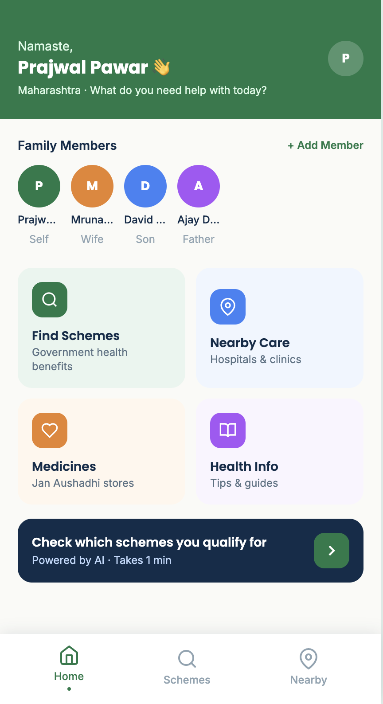
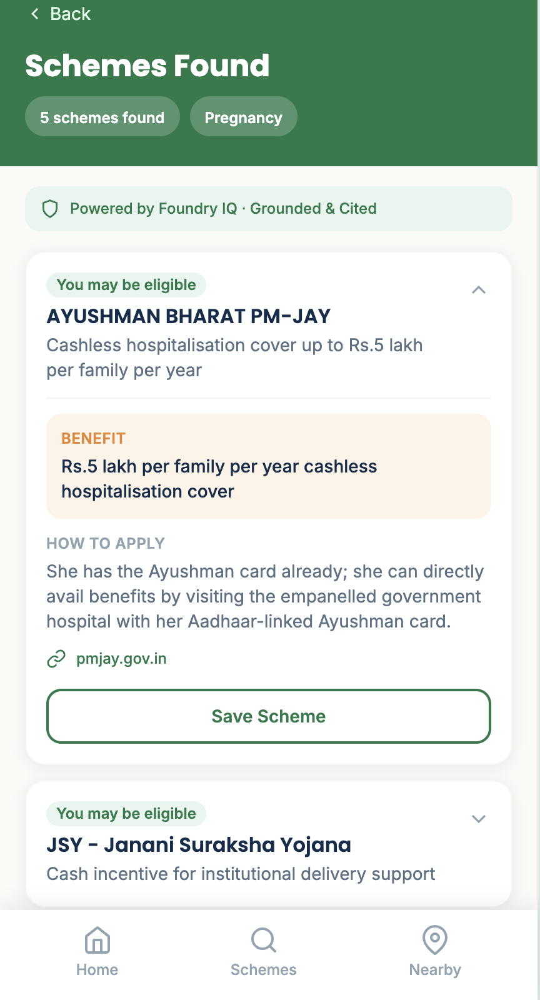
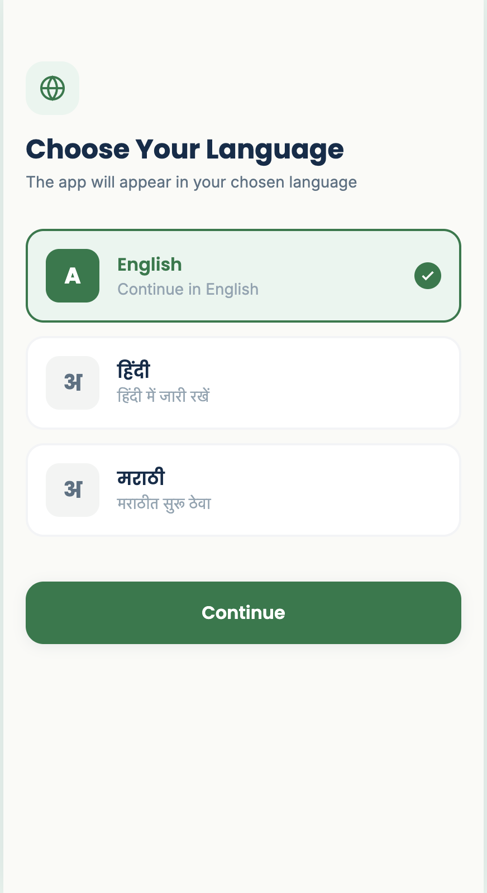
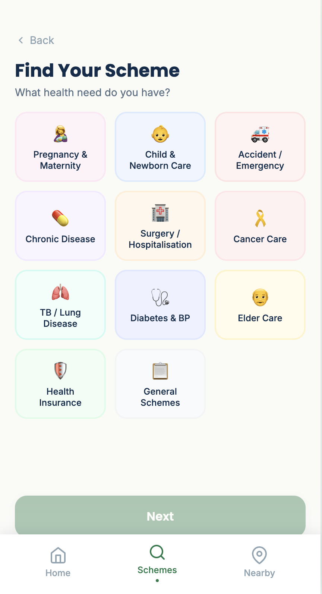
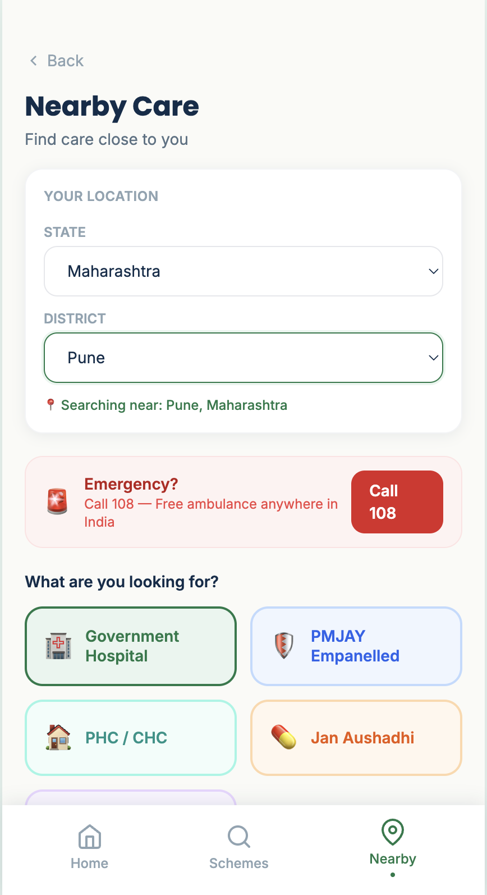

# 🌿 Swasthya Saathi — Your Family Health Companion

**Tagline:** AI-powered multilingual agent that helps rural Indian families discover government health schemes they qualify for — in their own language, in seconds.

[](https://witty-mud-06d37ba0f.7.azurestaticapps.net)
[](https://react.dev)
[](https://ai.azure.com)
[](https://azure.microsoft.com/en-us/products/ai-services/openai-service)
[](https://aka.ms/agentsleague)
[](https://aka.ms/agentsleague)

---

## 💡 The Inspiration

India has over **500 million rural citizens** eligible for government health schemes — yet most of them never claim a single benefit. The reasons are heartbreakingly simple: complex government portals built for bureaucrats, not beneficiaries. Information buried in English PDFs. No guidance for someone who can only read Hindi or Marathi. No way to know which of the dozen overlapping schemes applies to *your* family, *your* income, *your* condition.

A pregnant woman in rural Maharashtra deserves to know about JSY and PMMVY. A family battling TB deserves to know about Nikshay Poshan Yojana's ₹500/month nutritional support. A child with a heart condition deserves RBSK's free surgery. They qualify — they just don't know it.

This is the gap Swasthya Saathi was built to close.

---

## ✨ The Solution

Swasthya Saathi is a **multilingual AI health companion** powered by **Microsoft Foundry IQ** that acts as a knowledgeable, patient, and always-available guide for rural Indian families navigating the government health system.

A user simply:
1. Selects their preferred language (English, Hindi, or Marathi)
2. Builds a complete family profile — income, state, occupation, health needs
3. Tells the agent what support they need
4. Receives **instant, grounded, cited scheme recommendations** — with exact benefits, eligibility criteria, and step-by-step application guidance

Unlike generic chatbots, Swasthya Saathi reasons across the **entire family unit** — not just one person — and cross-references multiple schemes simultaneously to find everything a family qualifies for in one go.

---

## 📸 Screenshots / Demo

> 🎥 **[Try the Live App →](https://witty-mud-06d37ba0f.7.azurestaticapps.net)**

| Welcome Screen | Family Dashboard | Scheme Results |
|---|---|---|
|  |  |  |

| Language Select | Scheme Finder | Nearby Care Hub |
|---|---|---|
|  |  |  |

---

## 🧠 How the Agent Reasons

This is where Foundry IQ makes the difference. When a user submits their health need, the agent does **not** just keyword-match — it performs multi-step contextual reasoning:

**Step 1 — Profile Ingestion**
The agent receives the complete family context: income bracket, state, occupation, Ayushman card status, age of each member, and the specific health need selected.

**Step 2 — Multi-Scheme Cross-Reference**
The agent simultaneously evaluates eligibility across all 9 national health schemes, checking income thresholds, geographic applicability, and category-specific criteria (e.g., BPL status for PMJAY, employment type for ESIC, pregnancy status for JSY/PMMVY).

**Step 3 — Ranked Grounded Recommendations**
Results are ranked by relevance and eligibility confidence. Each recommendation includes:
- What the scheme covers (exact benefit amounts)
- Why this user qualifies
- Exactly how to apply (step-by-step)
- Official source citation (pmjay.gov.in, nhm.gov.in, etc.)

**Step 4 — Multilingual Response**
The entire response is delivered in the user's chosen language — English, Hindi, or Marathi.

**Example Agent Response:**
```json
{
  "schemes": [
    {
      "name": "AYUSHMAN BHARAT PM-JAY",
      "shortDesc": "Cashless hospitalisation cover for families below poverty line",
      "benefit": "Up to ₹5 lakh per family per year for hospitalisation including surgery, chemotherapy, radiation for early-stage cancer — cashless at empanelled hospitals.",
      "eligibility": "Family income below ₹1 lakh per year, listed in SECC database",
      "howToApply": "Use existing Ayushman Card at empanelled hospital; Ayushman Mitra can verify eligibility or generate card; or visit Common Service Centre (CSC).",
      "source": "pmjay.gov.in",
      "confidence": "high"
    }
  ]
}
```

> Every response is **grounded** — anchored to official scheme knowledge via Foundry IQ, not generated from model memory alone. This eliminates hallucination risk for health-critical information.

---

## 🚀 Key Features

- **🤖 Foundry IQ Reasoning Agent** — Powered by Microsoft Azure AI Foundry with GPT-4o via the Responses API (`2025-11-15-preview`). The agent reasons across 9 national health schemes simultaneously, cross-referencing the full family profile to return grounded, cited answers — not generic information.

- **👨‍👩‍👧 Family-First Multi-Member Reasoning** — Users build a complete family profile including spouse, children, and dependents. Each member gets personalized scheme recommendations based on their own profile — the agent reasons across the entire household, not just one individual.

- **🌐 Trilingual Support** — Full UI in English, Hindi (हिंदी), and Marathi (मराठी). Every label, prompt, error message, and navigation element is localized — making the app genuinely accessible for rural, low-literacy users across Maharashtra, UP, Bihar, and beyond.

- **🛡️ Grounded & Cited Answers** — Every scheme recommendation is tagged with its official government source. Users and judges can verify every claim. No hallucinations, no guesswork — this is health information, accuracy is non-negotiable.

- **📍 Nearby Care Hub** — Integrated location-based search helps users find the nearest government hospitals, PHCs, Jan Aushadhi Kendras, and Anganwadi centres — bridging the gap from "I qualify" to "I know where to go."

- **💊 Medicines & Health Info** — Dedicated screens for finding affordable generic medicines (Jan Aushadhi) and actionable health awareness tips across maternal health, child health, TB, diabetes, and general wellness.

- **📱 Mobile-First Design** — Built for the 430px smartphone screen that most rural Indians use. Clean, icon-driven design optimised for low-end Android devices on 4G connections.

- **🔒 Safe & Reliable** — Mandatory field validation, no sensitive data stored server-side, grounded retrieval prevents misinformation. Built with reliability-first principles for health-critical use.

---

## 🏥 Schemes Covered (9 National Health Schemes)

| Scheme | Who It Helps | Key Benefit |
|--------|-------------|-------------|
| **PMJAY (Ayushman Bharat)** | BPL families | ₹5 lakh/year cashless hospitalisation |
| **JSY** | Pregnant women | Cash incentive for institutional delivery |
| **PMMVY** | First-time mothers | ₹5,000 maternity benefit |
| **ESIC** | Organised sector workers | Comprehensive medical + cash benefits |
| **RBSK** | Children 0–18 yrs | Free screening & treatment for 30+ conditions |
| **NTEP (DOTS)** | TB patients | Free treatment + ₹500/month nutrition support |
| **CGHS** | Central govt employees | OPD, IPD, specialist care at empanelled hospitals |
| **NPCDCS** | Adults 30+ yrs | Free cancer, diabetes & stroke screening |
| **NHM** | All rural citizens | Free OPD, medicines, maternal & child health |

---

## 🛠️ Built With

| Layer | Technology |
|-------|-----------|
| **Frontend** | React 18, Vite, Tailwind CSS |
| **AI Agent** | Microsoft Azure AI Foundry (Foundry IQ) |
| **Model** | GPT-4o Global Standard deployment |
| **Agent Protocol** | Azure Responses API `2025-11-15-preview` |
| **Grounding** | Foundry IQ — grounded retrieval with source citations |
| **Deployment** | Azure Static Web Apps |
| **CI/CD** | GitHub Actions (secrets-based env injection) |
| **Maps** | Google Maps API — Nearby Care Hub |
| **i18n** | Custom React Context — English, Hindi, Marathi |
| **State** | React Context API — no external dependencies |

---

## 🧱 Architecture

```
User (Mobile Browser — English / Hindi / Marathi)
        │
        ▼
┌─────────────────────────────────────────────┐
│         React Frontend (Vite + Tailwind)     │
│                                             │
│  AppContext (State + i18n + Navigation)     │
│  ┌──────────┐  ┌──────────┐  ┌──────────┐  │
│  │ Profile  │  │ Family   │  │ Scheme   │  │
│  │ Manager  │  │Dashboard │  │ Finder   │  │
│  └──────────┘  └──────────┘  └────┬─────┘  │
│                                   │        │
│  ┌──────────┐  ┌──────────┐       │        │
│  │ Nearby   │  │Medicines │       │        │
│  │ Care Hub │  │& Health  │       │        │
│  └──────────┘  └──────────┘       │        │
└───────────────────────────────────┼────────┘
                                    │
                                    ▼
                    ┌───────────────────────────┐
                    │   Microsoft Foundry IQ    │
                    │   Azure AI Foundry Agent  │
                    │   (Swasthya-Saathi)       │
                    │   Model: GPT-4o           │
                    │   Protocol: Responses API │
                    │   Grounded & Cited        │
                    └───────────────────────────┘
                                    │
                                    ▼
                    ┌───────────────────────────┐
                    │  Azure Static Web Apps    │
                    │  CI/CD via GitHub Actions │
                    └───────────────────────────┘
```

---

## 💻 Getting Started

### Prerequisites

- Node.js v18+
- npm or yarn
- Microsoft Azure AI Foundry account

### Installation

1. **Clone the repository**
   ```bash
   git clone https://github.com/PrajwalP0571/swasthya-saathi.git
   cd swasthya-saathi
   ```

2. **Install dependencies**
   ```bash
   npm install
   ```

3. **Set up environment variables**

   Create a `.env` file in the root:
   ```env
   VITE_FOUNDRY_ENDPOINT=your_foundry_agent_responses_endpoint
   VITE_FOUNDRY_KEY=your_foundry_api_key
   ```

   > Get these from: Azure AI Foundry → Your Project → Agents → Swasthya-Saathi → Endpoint Details

4. **Run locally**
   ```bash
   npm run dev
   ```
   Open `http://localhost:5173`

5. **Production build**
   ```bash
   npm run build
   ```

### Setting Up Your Own Foundry Agent

1. Go to [ai.azure.com](https://ai.azure.com) → Create Project
2. Deploy GPT-4o model under Deployments
3. Go to Agents → New Agent → Name it `Swasthya-Saathi`
4. Set system instructions and save
5. Copy the Responses API endpoint from Agent Details
6. Add endpoint + key to your `.env`

---

## 🔮 What's Next

Swasthya Saathi is a working prototype. With more time, here's the roadmap:

- **📄 Azure AI Search Knowledge Base** — Ingest all 25 official government PDFs into Azure AI Search for verbatim document-grounded citations — deepening the Foundry IQ integration
- **🗣️ Voice Input** — Speech-to-text in Hindi and Marathi for users who struggle with typing
- **📶 Offline PWA Mode** — Service worker support for low-connectivity rural areas
- **👩‍⚕️ ASHA Worker Dashboard** — Companion view for community health workers to look up schemes for multiple families in their village
- **📲 WhatsApp Integration** — Scheme recommendations delivered via WhatsApp for users without smartphones
- **📊 Scheme Application Tracker** — End-to-end tracking of a family's application status
- **🌍 10+ Languages** — Tamil, Telugu, Bengali, Gujarati — reaching 800M+ more citizens
- **🏥 Hospital Empanelment Check** — Real-time verification if a nearby hospital accepts PMJAY/Ayushman

---

## 🏆 Hackathon Submission

| Detail | Value |
|--------|-------|
| **Hackathon** | Microsoft Agents League 2026 |
| **Track** | Reasoning Agents |
| **IQ Layer** | Foundry IQ — Azure AI Foundry Agent, GPT-4o, Responses API |
| **Live URL** | [witty-mud-06d37ba0f.7.azurestaticapps.net](https://witty-mud-06d37ba0f.7.azurestaticapps.net) |
| **Discord** | prajwalpawar_95526 |

---

## 👥 Team

| Name | Role | Profile |
|------|------|---------|
| **Prajwal Pawar** | Full Stack Developer & AI Integration | [](https://github.com/PrajwalP0571) |

---

## 📄 License

This project is open source and available under the [MIT License](LICENSE).

---

<div align="center">

**Built with ❤️ for rural India**

*Because quality healthcare guidance should be available to everyone — in every language, in every village.*

[](https://witty-mud-06d37ba0f.7.azurestaticapps.net)

</div>
